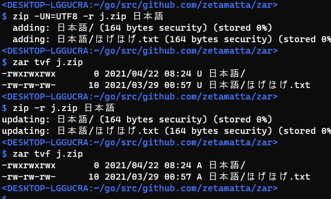

zar
===

`zar` is the zip-clone with tar-interface.

[Download binaries](https://github.com/zetamatta/zar/releases)

Motivation
----------

- I often forget `-r` option on the native zip-interface
    - I prefer the tar-interface. But my colleagues do not know tar-archives. I have to use zip-archives.
- I want to know the filenames are encoded by UTF8 or not ?
    - The fifth field of the output that `zar tvf` indicates the encoding of the filename.
        - `U` ... UTF8
        - `A` ... NonUTF8(ANSI)
- Are The files contained correctly ?
    - `zar --md5 -tvf` show MD5SUMs of contained files

```
$ zar --md5 -tvf zar-noversion-linux-amd64.zip
b52fa7c45800545279d3a8264484386b -rw-rw-rw-  694516 2021/10/23 00:28 U zar
```

Create an archive
-----------------

- `zar cvf ARCHIVE.zip [files...]`
- `zar cvf - [files...] > ARCHIVE.ZIP`

The filename encoding is always set as UTF8.

### Option

- `--remove-files` removes files from disk after adding them to the archive.
- `-C DIRECTORY` change directory

List an archive
----------------

- `zar tvf ARCHIVE.zip [files...]`  
- `zar tvf - [files...] < ARCHIVE.ZIP` \*

### Option

- `--md5` show MD5SUMs of contained files

Extract an archive:
-------------------

- `zar xvf ARCHIVE.zip [files...]`  
- `zar xvf - [files...] < ARCHIVE.ZIP` \*

---

- Reading the archive file from STDIN is slow because the ZIP file has the file list in the tail of the archive and we have to make a temporary file to access randomly.
- By golang's "archive/zip" package.


